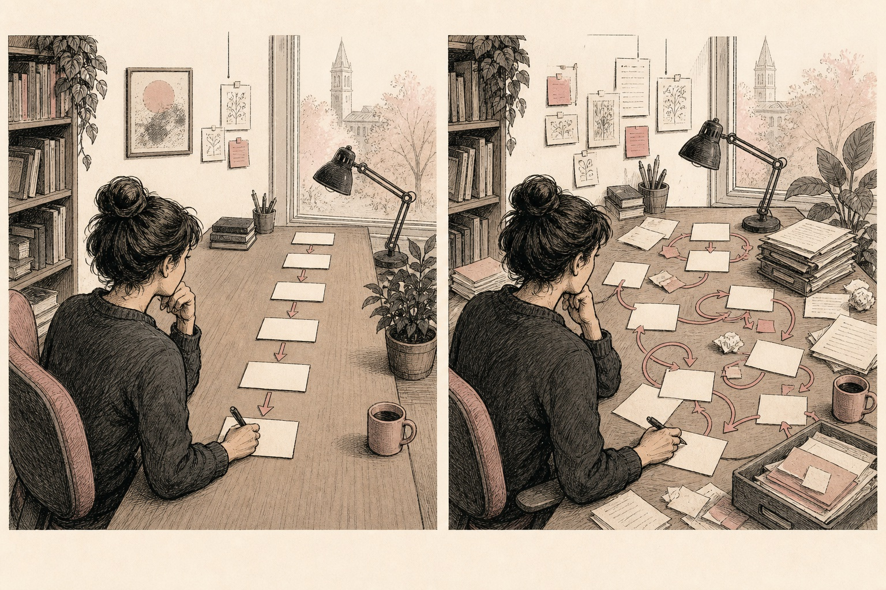

A proposal gets you started. Once you enrol, you can find out whether the data are available, how recruitment might work and how much time the study will take. This usually gives you a few reasons to revise it.

Start with the proposal you have. We'll turn its promises and guesses into things you can check, then build a plan you can update as you learn.

## Start by testing the proposal

Read the proposal as an opening argument. Go through it line by line and separate commitments, evidence, assumptions, options and unknowns. Then add the dependencies and review points that were probably invisible when the proposal was written.

A useful plan makes the next important decisions visible. It also says what evidence would support them and what could get in the way.

::: {.handbook-visual .original-meme}
::: {.meme-line}
**The project plan was a straight line.**
:::

{fig-alt="Two panels show the same graduate researcher: first arranging a simple linear sequence of cards, then navigating a looping network of revisions and returned folders."}

::: {.meme-line}
**The project had other ideas.**
:::

::: {.visual-credit}
Original illustration created for *The Handbook for the Recently Enrolled* with human editorial direction and AI-assisted production.
:::
:::

## What changes after enrolment

Reading may change the question. An ethical or technical constraint may rule out a method, or your supervisors may suggest a stronger contribution. Record each substantial change and its reason so you can explain how the project developed.

## Sort promises from guesses

Mark each important statement using one of five states:

| State | Meaning | What to do |
|---|---|---|
| Confirmed commitment | A current rule, agreement or approved constraint requires it | Record the authoritative source and change process |
| Supported working decision | Evidence currently favours it | Record the rationale and review trigger |
| Assumption | It is being treated as true but has not been tested | Assign a test, owner and date |
| Option | It remains one plausible path | State what evidence would select or reject it |
| Unknown | The question has not been resolved | Put it in the unresolved-questions log |

“The study will recruit 100 participants” may be an assumption, not a commitment. “No participant contact before ethics approval” may be a firm constraint. Treating both as ordinary tasks conceals their different status.

::: {.decision-card}
**Smallest useful next action:** Annotate the proposal using the five states above. Move every assumption and unknown into a visible register rather than quietly carrying it into the timeline.
:::

## Build a plan you can revise

### 1. Summarise the project on one page

Write down the problem, current question, intended contribution, proposed evidence and main limitations. Keep it factual. You are describing the project as it stands today.

### 2. List the fixed constraints

Record milestones, funding periods, approvals, training, reporting, leave rules and any partner commitments. Link each entry to a current authoritative source. Do not rely on what another student remembers.

### 3. Mark the decision points

A decision gate is a point where evidence determines whether the project continues as planned, narrows, pivots, pauses or stops. Useful early gates include:

- enough orientation evidence to refine the question;
- confirmation of access or recruitment feasibility;
- method choice after comparison and specialist review;
- pilot evidence before scaling;
- required approval before participant or data-facing work.

### 4. Define what “done” looks like

Replace “finish literature review” with an inspectable result: “produce a six-theme evidence map, record the search limits and identify three unresolved claims for supervisor review”.

### 5. Expose dependencies

For each outcome, ask what must already be true. Name the owner of every dependency. “Ethics” is not an owner; the researcher may prepare the application, a supervisor may review it and a committee may decide it.

### 6. Decide when to review the plan

Review the plan when important evidence arrives, a dependency changes, a formal milestone approaches or the project exceeds an agreed tolerance. A plan without review triggers becomes stale while still looking official.

## Five records worth keeping

Begin with five recoverable records:

1. **Action register:** what will happen, owner, due date, status, dependency and evidence of done.
2. **Decision log:** the decision, options, evidence, rationale, owner and review trigger.
3. **Unresolved-questions log:** what is unknown, why it matters, next check and decision date.
4. **Risk and issues register:** potential and actual problems, consequence, response, owner and escalation point.
5. **Source trail:** where claims, requirements and evidence came from.

These records may live in a spreadsheet, database, plain-text files or an approved project platform. The tool matters less than recoverability, access control and consistent use.

Put time-specific commitments in the calendar, current work states in the action register, and reasoning in the decision log. Email is evidence of communication, not a complete project-management system.

## Example: recruitment had never been tested

The proposal assumes 60 specialist participants can be recruited in six months. The student converts this into:

- **Assumption:** 60 eligible participants are reachable.
- **Evidence needed:** credible pool size, contact route, likely response and exclusion rate.
- **Owner:** student, with partner contact confirming the eligible pool.
- **Gate:** feasibility decision before finalising the main study design.
- **Options:** original sample; fewer participants with a different design; additional sites; revised question.
- **Stop condition:** do not represent access as secured without written confirmation or begin recruitment without approval.

The team can now check recruitment before spending months designing a study that depends on it.

## How to decide

- **Fixed by current approval or agreement:** follow the formal change process.
- **High consequence and weak evidence:** test before committing resources.
- **Reversible and low risk:** choose a provisional option and set a review trigger.
- **Dependent on another person:** record their actual commitment, not your hope.
- **No longer supports the research question:** remove or redesign it even if work has already been invested.
- **Cannot be completed inside constraints:** narrow scope, change sequence or escalate; do not hide the conflict in an optimistic timeline.

## How plans drift away from reality

A timeline can look settled while access, dates and responsibilities are still guesses. Mark uncertain dates, give each action a named person and leave requests open until the answer arrives. Keep decisions somewhere you can find them after the meeting.

Review the plan when evidence changes, even if you've invested time in the original version. Record the reason for changing direction. Adding another planning tool won't help unless you maintain the records you already use.

## Pressure-test the plan

- [ ] Formal constraints are linked to current authoritative sources.
- [ ] Commitments, decisions, assumptions, options and unknowns are distinguished.
- [ ] Major feasibility and approval dependencies have owners and dates.
- [ ] Each next-phase outcome has observable evidence of completion.
- [ ] Decision gates and review triggers are scheduled.
- [ ] Actions, decisions, questions and risks have recoverable records.
- [ ] A realistic alternative exists for the most consequential unverified assumption.

**Stop condition:** Do not call the plan viable while essential access, approval, safety or resource assumptions remain invisible or ownerless.

## What to take to supervision

Bring the one-page project statement, annotated assumptions, the two most consequential decision gates, the main risk and your proposed next 90-day outcomes. Ask: “Which assumption would you test first, and what evidence would change our present direction?”

## When to ask for help

Escalate when a required decision sits outside the supervisory team's authority; a formal milestone is threatened; an agreed resource is unavailable; a partner commitment materially changes; work is being proposed outside an approval; or relationship and workload problems cannot be resolved through ordinary planning.

## Different projects need different plans

Laboratory, fieldwork, archival, computational, qualitative, creative and participatory projects have different dependencies and evidence. A practice-led project may use cycles of making and critical reflection; a computational project may use datasets, repositories and validation gates; a community partnership may require shared governance and longer relationship-building. Do not force all of them into a task-only project template.

## Useful templates

- [Action register](../../templates/action-register.qmd)
- [Decision log](../../templates/decision-log.qmd)
- [Unresolved-questions log](../../templates/unresolved-questions.qmd)
- [Risk and issues register](../../templates/risk-issues-register.qmd)
- [First 90-day review](../../checklists/first-90-day-review.qmd)
- [Topic due diligence](../../templates/topic-due-diligence.qmd)
- [I’m stuck](../../stuck/index.qmd)

## When funding does not match the plan

For practical prompts and a next conversation, see [the guide to life during a PhD](../../stuck/life-during-a-phd.qmd#funding).

## Evidence

The provisional-plan workflow is an editorial decision aid. Its separation of candidate, supervisor, organisation and collaborator responsibilities is consistent with—but not dictated by—the UKRI doctoral-training expectations; local candidature rules govern [@ukri-expectations-2024].

## References

[Full reference list](../../references.qmd).
