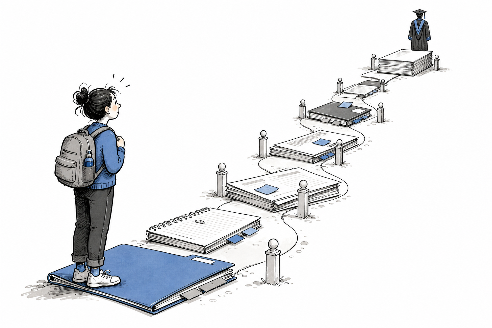

Keep this page beside your project plan. It follows the doctorate from considering an offer to handing over your work. Find your current stage, work through its checks and open the linked guidance when you need it. Return to the study checkpoints for each new study.

These checks draw on the approach described in *The Checklist Manifesto* and WHO guidance [@gawande2010checklist; @who2009checklist]. [How the checklists work](index.qmd) explains when to follow items in order and when to check work you've already done.

{#fig-doctoral-journey width="100%" fig-alt="A graduate researcher stands at the beginning of a winding path made from notebooks and document stacks, with a thesis and graduation gown visible in the distance."}

*Original illustration created for this handbook with human editorial direction and OpenAI image tools. [Visuals, humour and credit](../contributions/visuals-and-credit.qmd).*

::: {.callout-note title="Make this checklist yours"}
The boxes don't save when you refresh or close the page. Print it or copy the checks into your project system. Add dates and links to the relevant records as you go.
:::

## Before you accept or start

- [ ] I understand the offer, funding, expected mode and location, workload, conditions and likely out-of-pocket costs well enough to make an informed decision.
- [ ] I have asked what is fixed, what is still provisional and what could materially change the project.
- [ ] I know the proposed supervisory arrangement and have raised any questions about expertise, availability, location or project ownership.
- [ ] I have identified any immigration, employment, accessibility, caring, cultural, health or location constraints that could affect whether the arrangement is workable.
- [ ] I have kept the documents and answers that informed my decision.

**Use next:** read [the opening chapter on what a doctorate requires](../chapters/part-01/01-phd-and-good-enough.qmd). Local offer, visa, employment and funding terms take priority over general guidance.

## When candidature begins

- [ ] My official start, enrolment and first formal milestone are confirmed.
- [ ] My supervisory team, first meeting and working expectations are clear enough to begin.
- [ ] Required induction, safety, integrity, methods, data and ethics training has been identified.
- [ ] Research files have an approved home, a recoverable backup and clear ownership.
- [ ] I know where to seek independent help if supervision, safety, wellbeing, integrity or candidature problems arise.

**Detailed check:** [What should I set up when candidature begins?](starting-candidature.qmd)

## By the first 90-day review

- [ ] I can state the research problem, provisional question and intended contribution without hiding behind a broad topic.
- [ ] The central feasibility assumptions have been tested or recorded as unresolved risks.
- [ ] Supervision, meeting records, feedback and decision-making are working in practice.
- [ ] The literature-search approach, working technology, storage and backup systems have been tested.
- [ ] The next 90 days are expressed as a few outcomes with visible evidence of completion.

**Detailed check:** [What should I check after 90 days?](first-90-day-review.qmd)

## Before committing to each study

Repeat this checkpoint for every empirical study, secondary analysis, substantial method-development project or other major piece of thesis work.

- [ ] The question, intended inference and contribution fit together.
- [ ] The design, sample, measures, analysis and available expertise can support the claim.
- [ ] Access, recruitment, time, cost, equipment, software and workload assumptions have been tested with the people who control them.
- [ ] Ethics, governance, privacy, legal, cultural, safety and community obligations have a credible pathway.
- [ ] Continue, revise, pivot and stop criteria are recorded before sunk costs accumulate.

**Detailed checks:** use the [study-commitment check](before-study-commitment.qmd) and [research-question check](research-question-stress-test.qmd).

## Preparing the ethics or governance package

- [ ] The question, protocol, participant materials, consent process, data flow and analysis plan describe the same study.
- [ ] Risks, burdens, benefits, privacy protections and withdrawal arrangements are accurate rather than aspirational.
- [ ] Every site, dataset, community, partner and jurisdiction has the necessary authority and pathway.
- [ ] Version numbers, dates and attachments identify one reviewable submission package.
- [ ] The team knows what cannot begin until written approval is received.

**Detailed checks:** use the [ethics and governance submission check](before-ethics-submission.qmd) and [pilot-readiness check](pilot-readiness.qmd).

## Before data collection or data access

- [ ] The current approved protocol matches what the team is about to do.
- [ ] Recruitment, consent, instruments, roles, training, safety and escalation routes have been tested.
- [ ] Approved storage, identifiers, access permissions, transfer routes and backup recovery are working.
- [ ] The team can recognise and record a deviation, incident or change that needs review.
- [ ] A small dry run has exposed the obvious operational failures while they are still reversible.

**Detailed checks:** use the [data-collection check](before-data-collection.qmd) and [backup and restore check](backup-restore.qmd).

## While a study is running

- [ ] Approvals, registrations, permissions and agreements remain current as the work changes.
- [ ] Decisions, deviations, incidents, exclusions, missingness and protocol changes are recorded when they occur.
- [ ] Data states, code, instruments and file versions remain traceable to their source.
- [ ] Recruitment, burden, quality, safety, time and cost are reviewed against the agreed continue, pivot and stop criteria.
- [ ] Material changes are checked with the responsible authority before they are implemented.

**Use next:** [What should you do when work is blocked or plans change?](../chapters/part-09/26-risks-blocked-change.qmd)

## Before analysis

- [ ] The question, outcomes, inputs, exclusions and analysis decisions are explicit.
- [ ] The analysis uses the correct approved and quality-checked data state.
- [ ] Codebooks, provenance, software and environments are sufficient to reproduce the work proportionately.
- [ ] Departures from the planned analysis are labelled and justified rather than quietly rewritten as planned.
- [ ] The proposed claims do not exceed what the design and evidence can support.

**Detailed check:** [Is the project ready for analysis?](before-analysis.qmd)

## Before writing up each study

- [ ] The planned study has been reconciled with what actually happened.
- [ ] Deviations, missing data, failed procedures, exclusions and null or unexpected findings are visible.
- [ ] Tables, figures and claims can be traced to checked data and analysis outputs.
- [ ] The relevant reporting guidance has been identified without treating it as a substitute for methodological judgement.
- [ ] Contribution, authorship, acknowledgements and unresolved disagreements have been discussed before the draft hardens.

**Detailed check:** [Is this study ready to write up?](before-study-write-up.qmd)

## Before submitting a manuscript

- [ ] The outlet has been checked for scope, legitimacy, instructions, fees, policies and current disclosure requirements.
- [ ] Every author has approved the exact version, order and contribution statement.
- [ ] Claims, methods, approvals, registrations, reporting guidance, data statements and disclosures agree.
- [ ] Copyright, licences, acknowledgements, funding and conflicts are complete.
- [ ] The exact submitted package and receipt will be retained.

**Detailed check:** [Is this manuscript ready to submit?](before-manuscript-submission.qmd)

## At formal progress reviews

- [ ] The review shows decisions, evidence, changes, risks and next commitments rather than a list of activity.
- [ ] The research question, scope and thesis contribution still fit the available time and evidence.
- [ ] Delays, failures and changes are explained honestly, with owners and next decisions.
- [ ] Supervisory disagreements and support needs are visible early enough to act on them.
- [ ] The next review period has a small number of defensible outcomes and review dates.

**Use next:** [What evidence shows your project is moving?](../chapters/part-09/25-milestones-weekly-work.qmd)

## Before submitting the thesis

- [ ] The thesis makes one coherent and appropriately bounded contribution.
- [ ] Required declarations, approvals, permissions, authorship statements and incorporated works are complete.
- [ ] Citations, tables, figures, appendices, cross-references and final files have been checked from the exact submission version.
- [ ] Current examination and submission requirements have been verified from an official local source.
- [ ] The uploaded file has been reopened and checked, and the receipt has been retained.

**Detailed check:** [Is the thesis ready to submit?](before-thesis-submission.qmd)

## During examination and corrections

- [ ] Examiner requests are separated into distinct, traceable actions.
- [ ] Each response records the decision, change, location and rationale.
- [ ] New analysis or claims are checked for approval, authorship, consistency and knock-on effects elsewhere in the thesis.
- [ ] The corrected thesis, response document and approval record identify the same final version.
- [ ] A disagreement with an examiner is handled through the formal process rather than silent non-compliance.

**Use next:** [How do you prepare for examination and corrections?](../chapters/part-12/35-examination-corrections.qmd)

## Before closure, handover or departure

- [ ] Final records have approved, documented locations that do not depend on one person’s account or device.
- [ ] Retention, disposal, ownership, access, embargo, confidentiality and sharing obligations have been reconciled.
- [ ] Data, code, metadata, software dependencies, decisions and outputs are intelligible to an authorised future user.
- [ ] Open obligations have an owner, and personal access can end without breaking shared systems.
- [ ] The recipient has actually opened the critical files and tested the recovery or reproduction route.

**Detailed check:** [Is this project ready to close or hand over?](project-closure-handover.qmd)

## After completion

- [ ] The final thesis, publications, data, code, professional records and persistent identifiers are linked where permitted.
- [ ] Ongoing corrections, retractions, reporting, access, retention and community or partner obligations have an owner.
- [ ] My contribution and the contributions of others are described accurately.
- [ ] Reusable materials have clear licences and third-party material is not accidentally relicensed.
- [ ] I have recorded what should be maintained, reviewed, transferred or deliberately stopped.

**Use next:** [How do you close a project without losing its value?](../chapters/part-12/36-closure-transition.qmd)

## Pause before irreversible steps

Get confirmation from the responsible authority before participant contact, restricted-data access, hazardous work, consequential protocol changes, submission or disposal.
