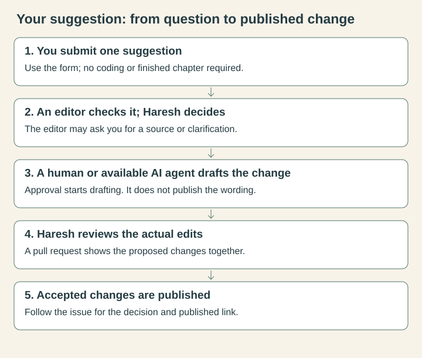
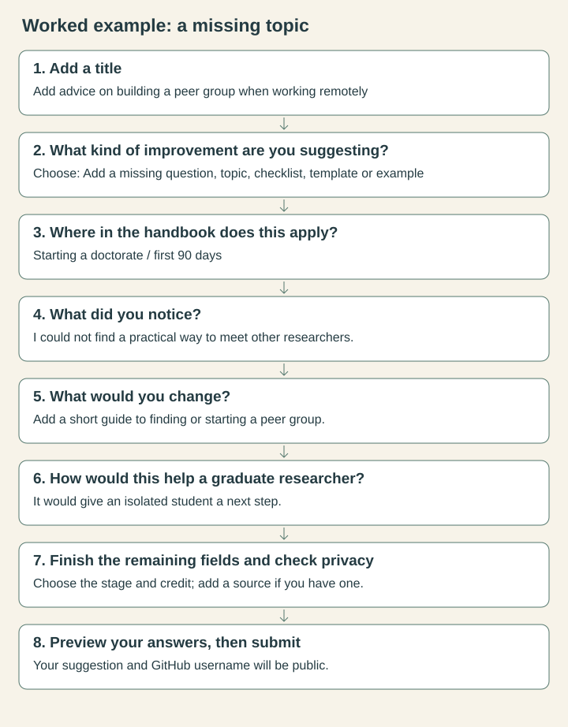

You can send a useful suggestion without knowing Git or editing the handbook. The form asks where the problem appears, what you noticed, what you would change and how the change would help.

[Suggest an improvement](https://github.com/hareshsuppiah/handbook-for-the-recently-enrolled/issues/new?template=share-feedback.yml){.btn .btn-primary}

GitHub uses issue forms to turn structured answers into a public record [@github-creating-issue; @github-issue-forms]. GitHub calls that record an **issue**. For this handbook, it means a reader suggestion.

{fig-alt="Five stages: submit a suggestion, editorial check and approval, human or AI drafting, editorial review, then publication of accepted changes."}

## What you need

- a free GitHub account;
- one suggestion;
- the page link and heading, or where you expected to find the missing material; and
- a description with personal and confidential details removed.

If you are new to GitHub, [create a free personal account](https://github.com/signup). GitHub may ask you to verify your email address. Its [account guide](https://docs.github.com/en/account-and-profile/how-tos/account-management/creating-an-account-on-github) explains the current steps. Return to this page when the account is ready.

## Complete the form

1. Open [Suggest an improvement](https://github.com/hareshsuppiah/handbook-for-the-recently-enrolled/issues/new?template=share-feedback.yml).
2. Sign in if GitHub asks you to.
3. In **Add a title**, write a short description such as `Add guidance on repeating a pilot after recruitment changes`.
4. Choose the closest kind of improvement. The category does not need to be perfect.
5. Paste the page link and name the heading. If the material is missing, say where you expected to find it.
6. Describe what you noticed.
7. Describe the change you would like. You can suggest an outcome without writing the final wording.
8. Explain how the change would help a graduate researcher.
9. Choose the stage when the suggestion matters most.
10. Add a source or shareable example if you have one. Explain what it supports and where it applies.
11. State how you would like to be credited.
12. Confirm that you have removed private material and understand that the suggestion will be public.
13. Use **Preview** above any long answer if you want to check links or lists. Return to **Write** to make a correction.
14. Read the title and answers once more, then select **Submit new issue**.

{fig-alt="Worked example: suggest peer-group guidance, select the missing-topic category, identify first-90-days coverage, explain the gap and benefit, then finish the credit and privacy fields before submitting."}

The diagram follows the handbook form. GitHub may move its buttons as the interface changes.

## Worked examples

### A question is missing

> I was trying to decide whether to run another pilot after changing the recruitment procedure. The pilot guidance discusses instruments and analysis, but not changes to recruitment. A short decision prompt would help students decide whether the change affects feasibility or ethics approval.

### Something may be wrong

> This paragraph appears to describe one institution's confirmation process as if it were universal. The general point is useful, but the milestone name and timing vary. Please separate the general decision from the local rule.

### Something should be removed or reduced

> The second checklist repeats the decision already covered in the first table. I reached the same instruction three times before finding the next action. Combining them would make the chapter easier to use, provided the escalation warning remains.

### I have a useful source

> This national research-integrity guideline supports the distinction made in the chapter. It applies in Australia, so it should be presented as jurisdiction-specific evidence rather than a universal rule.

These examples show the amount of detail that helps. A few specific sentences are enough.

## Leave private and copyrighted material out

Do not include names, identifiable personal information, participant data, private correspondence, complaints casework, confidential research, credentials or unpublished findings you cannot share. Do not paste long extracts from copyrighted books, articles, templates, comics or images. Link to the source and explain its relevance.

## Follow the reply

After you select **Submit new issue**, GitHub opens a page with a number such as `#42`. Save that page or use GitHub's **Subscribe** control to receive updates. Notification delivery depends on your [GitHub notification settings](https://docs.github.com/en/subscriptions-and-notifications).

An editor may ask a question in a comment. Reply in the box at the bottom of the issue so the discussion stays with the suggestion. You can mention a new source or clarify the scope there.

## Change something after submission

You can edit an issue that you created [@github-creating-issue]. Open the suggestion and choose **Edit** on the first post. Change the title or answers, then save the update. Add a comment instead when you are answering an editor, because that preserves the conversation.

Read [How suggestions become edits](editorial-workflow.qmd) to follow the review and publication process.

## If you want to write or review material

Academics can offer a source check, a disciplinary example or a review of a named section. PhD students can contribute a question, a confusing passage or a shareable practical example. Neither group needs to code. State your offer in **What would you change?**, and give the page or topic so the editor can agree the scope with you.

If you want to draft the actual text, say so in the same form. Wait for the editorial decision before investing in a full chapter. After acceptance, agree the pages, evidence and review arrangements on the issue. You can put short proposed wording in a comment; someone comfortable with GitHub can prepare the pull request. Credit follows your contribution and stated preference.

## GitHub words and buttons

| Term or option | What it means here | Do you need it? |
|---|---|---|
| Issue | The public suggestion and its discussion | Yes: the form creates it for you. |
| Comment | A reply or clarification on that suggestion | Use it to answer the editor. |
| Subscribe | Follow updates to the issue | Optional; check notification settings. |
| Label | A short status tag applied by an editor or automation | Read it to see progress. |
| Pull request (PR) | A proposed set of edits for review | Only if you volunteer to prepare edits. |
| Branch / fork | A separate place to prepare changes | Not needed to suggest or review an idea. |
| Merge | Accept the edits into the main handbook source | An authorised editor decides whether to publish. |
| Discussions / blank issue | Alternative GitHub conversation routes | Not used for handbook suggestions. |
| Private Editorial Desk | An editor's workspace over the issue record | Contributors do not need access. |

[View the suggestion tracker](tracker.qmd) to follow existing requests before opening a new one.
