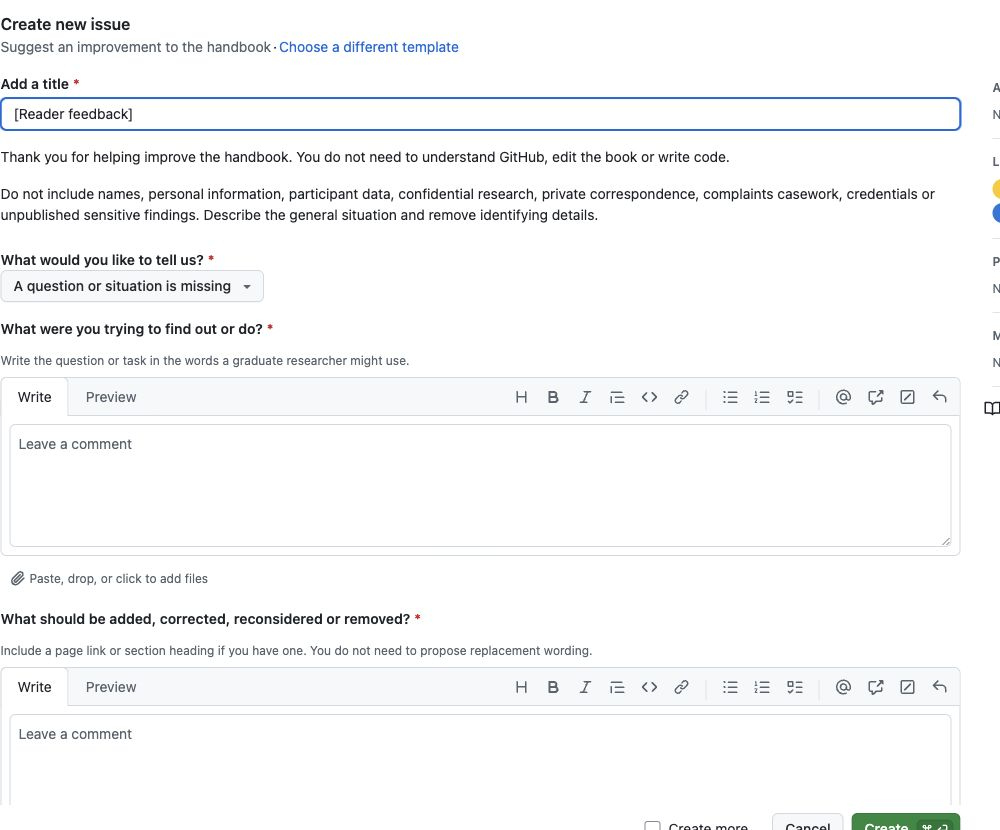

You can submit a useful suggestion in a few clear sentences. The form asks what you were trying to do, what should change and why it matters. It does not ask you to rewrite the handbook.

[Open the reader suggestion form](https://github.com/hareshsuppiah/handbook-for-the-recently-enrolled/issues/new?template=share-feedback.yml){.btn .btn-primary}

GitHub uses issue forms to collect structured requests and turn the answers into a public record [@github-creating-issue; @github-issue-forms]. The word **issue** is GitHub's label. For this handbook, it means a reader suggestion.

## What you need

- a free GitHub account;
- one question, correction, proposed removal, missing resource, source or accessibility problem;
- a page link or section title if you know where it applies; and
- a version of the situation with personal and confidential details removed.

If you do not have a GitHub account, the form first offers sign-in or account creation. After signing in, GitHub returns you to the handbook form. A separate no-login route is not active yet.

## Complete the form

1. Open the [reader suggestion form](https://github.com/hareshsuppiah/handbook-for-the-recently-enrolled/issues/new?template=share-feedback.yml).
2. Sign in to GitHub or create a free account if prompted.
3. Finish the title after the prefilled words `[Reader feedback]`. Use a short description such as `Add guidance on repeating a pilot after recruitment changes`.
4. Under **What would you like to tell us?**, choose the closest type. You do not need to find a perfect category.
5. Under **What were you trying to find out or do?**, write the question or task in the words a graduate researcher might use.
6. Under **What should be added, corrected, reconsidered or removed?**, name the page or section and describe the problem. You do not need to supply replacement wording.
7. Under **What could happen if the handbook does not address this?**, explain the likely confusion, wasted effort, error or harm. Write `Minor` if the consequence is small.
8. Choose the candidature stage when the reader would need the guidance.
9. **Optional:** Add a source or example that you are allowed to share. Say what it supports and whether it applies generally or only in a particular context.
10. Choose how you would like to be credited if the suggestion is used.
11. Confirm that you understand the submission is public and that you have removed sensitive material.
12. Select **Create**. Your suggestion receives a number and becomes part of the public editorial record.

{#fig-github-reader-form width="100%" fig-alt="The GitHub suggestion form shows a title field, a feedback-type menu and prompts asking what the reader was trying to do and what should change."}

*The handbook suggestion form after sign-in. The interface belongs to GitHub, Inc. This cropped screenshot was captured on 29 August 2026 for instruction and is excluded from the handbook's CC BY 4.0 licence. GitHub's current procedure is documented in [Creating an issue](https://docs.github.com/en/issues/tracking-your-work-with-issues/using-issues/creating-an-issue).*

## What should I write?

A strong suggestion answers four questions:

1. **Where does this apply?** Link the page or name the section if you can.
2. **What was the researcher trying to decide or do?** Use the words a student might actually use.
3. **What is missing, wrong or no longer useful?** Describe the problem rather than polishing a replacement.
4. **Why does it matter?** Describe the likely consequence. Add a source or example when you have one.

It also helps to say whether the suggestion applies broadly or only in a particular country, institution, discipline, method or form of candidature.

## Worked examples

### A question is missing

> I was trying to decide whether to run another pilot after changing the recruitment procedure. The pilot guidance discusses instruments and analysis, but not changes to recruitment. A short decision prompt would help students decide whether the change affects feasibility or ethics approval.

### Something may be wrong

> This paragraph appears to describe one institution's confirmation process as if it were universal. The general point is useful, but the milestone name and timing vary. Please separate the general decision from the local rule.

### Something should be removed or reduced

> The second checklist repeats the decision already covered in the first table. I reached the same instruction three times before finding the next action. Combining them would make the chapter easier to use, provided the escalation warning remains.

### I have a useful source

> This national research-integrity guideline supports the distinction made in the chapter. It applies in Australia, so it should be presented as jurisdiction-specific evidence rather than a universal rule.

These are patterns, not scripts. A few specific sentences are enough.

## What should I leave out?

Do not include names, identifiable personal information, participant data, private correspondence, complaints casework, confidential research, credentials or unpublished findings you cannot share. Do not paste long extracts from copyrighted books, articles, templates, comics or images. Link to the source and explain its relevance.

## What happens after submission?

1. An editor checks the suggestion for privacy, duplication and existing coverage.
2. The evidence, scope and likely consequence are assessed.
3. The project lead records one of the available editorial decisions.
4. If drafting is approved, an AI agent or human contributor may prepare a pull request.
5. A human reviews the proposed change before it can be published.
6. The issue records the outcome and any released change.

Read [How suggestions become handbook changes](editorial-workflow.qmd) for the full workflow. Approval does not send automatically generated wording into the handbook. It begins a controlled drafting and review stage.
