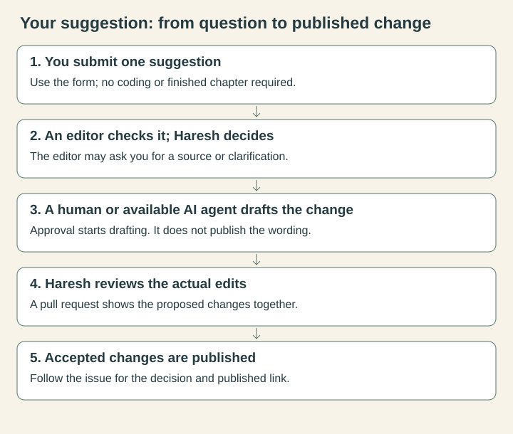
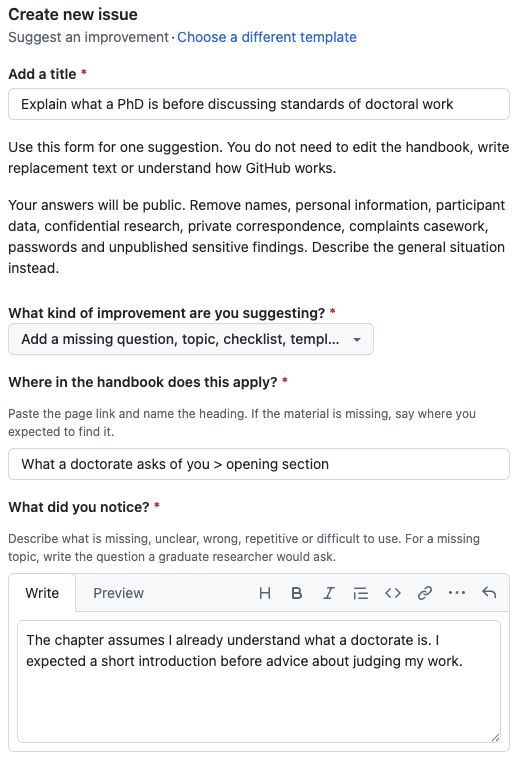
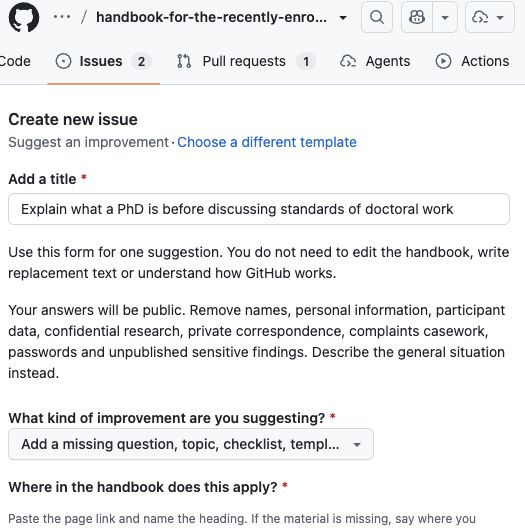
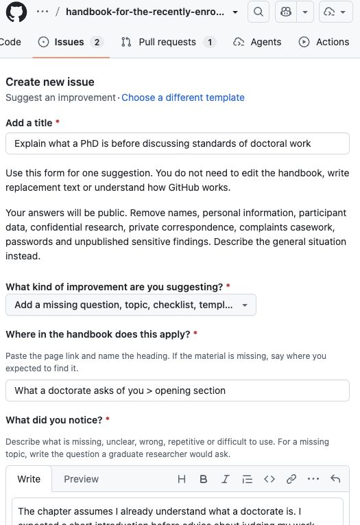

You can send a useful suggestion without knowing Git or editing the handbook. The form asks where the problem appears, what you noticed, what you would change and how the change would help.

You don't need a finished paragraph, a reading list or instructions for an AI agent. Tell us what you were hoping to understand. The editorial team can work out the research and writing needed from there.

[Suggest an improvement](https://github.com/hareshsuppiah/handbook-for-the-recently-enrolled/issues/new?template=share-feedback.yml){.btn .btn-primary}

GitHub uses issue forms to turn structured answers into a public record [@github-creating-issue; @github-issue-forms]. GitHub calls that record an **issue**. For this handbook, it means a reader suggestion.

{fig-alt="Five stages: submit a suggestion, editorial check and approval, human or AI drafting, editorial review, then publication of accepted changes."}

## What you need

- a free GitHub account;
- one suggestion;
- the page link and heading, or where you expected to find the missing material; and
- a description with personal and confidential details removed.

If you are new to GitHub, [create a free personal account](https://github.com/signup). GitHub may ask you to verify your email address. Its [account guide](https://docs.github.com/en/account-and-profile/how-tos/account-management/creating-an-account-on-github) explains the current steps. Return to this page when the account is ready.

## Complete the form

### 1. Say where you got stuck

Open [Suggest an improvement](https://github.com/hareshsuppiah/handbook-for-the-recently-enrolled/issues/new?template=share-feedback.yml) and sign in if asked. Write a short title, choose the closest kind of improvement, and add the page link and heading. If a section is missing, say where you expected to find it.

Under **What did you notice?**, describe your experience. A few sentences are enough. Fields marked with an asterisk are required.

{fig-alt="GitHub Create new issue form showing Add a title, improvement type, page location and What did you notice. The example asks for an introduction to what a doctorate is." width=520}

*Screenshot captured 8 September 2026. This example was filled in for the guide and was not submitted.*

### 2. Describe what would help

Under **What would you change?**, say what you want to understand or do. Then explain the benefit and choose the stage when it matters. You can write “Small clarity edit” for a small correction. Sources are optional; give a link and its relevance if you have one.

**Write** is the editing view. **Preview** shows how an answer's formatting and links will look. You can leave the formatting buttons alone and use ordinary text.

{fig-alt="GitHub text fields with Write and Preview tabs. The example asks for a simple explanation of an original contribution and says it would help a new researcher understand the advice." width=525}

### 3. Check privacy, then create the suggestion

Choose how you want to be credited. “No public credit” means no acknowledgement in the handbook; **your GitHub username and the issue are still public**. Read your answers, remove private material and tick the two privacy confirmations.

If GitHub suggests a **Potential duplicate**, open it in another tab and see whether it already covers your point. You can add a useful detail to that discussion instead.

When ready, select **Create**. Some GitHub layouts call this **Submit new issue**. This is the step that posts your suggestion publicly. Leave **Create more** unticked unless you want another blank form afterwards. You can ignore the Assignees, Labels, Projects and Milestone controls; the editorial team handles those.

{fig-alt="Before posting, choose credit, confirm that private material is removed and that your username will be public, check a potential duplicate, then select Create. The screenshot's privacy boxes are intentionally unticked." width=525}

These are dated captures of GitHub, not a live form. Layout and button names can change; the written steps describe the same actions.

## Add a screenshot when it explains the problem

A screenshot helps with a clipped table, a missing navigation button or a page that is hard to use on a phone. In **What did you notice?**, use **Add Files**, or paste a screenshot into the answer. Before attaching it, crop to the relevant page area and remove names, account details, notifications, private tabs and research data. Reopen the saved image to check it.

Also describe the problem in words: the page, device or browser, what you tried, what happened and what you expected. Images alone are difficult to search and may be inaccessible. For example: “On a phone, the final column of the meeting table is cut off and I cannot scroll to it.”

## Worked examples

### The chapter starts too far ahead

> In “What a doctorate asks of you”, I expected an introduction to what a PhD is before advice about doing one. Could you explain its purpose, including the philosophical idea of contributing knowledge and how universities in different countries describe it? I don't have particular sources to recommend. A short introduction would help a new student understand the advice that follows.

This is enough to start a review. You don't need to choose the universities or decide how many words to add. Those choices can be proposed on the suggestion page before drafting begins.

### A question is missing

> I was trying to decide whether to run another pilot after changing the recruitment procedure. The pilot guidance discusses instruments and analysis, but not changes to recruitment. A short decision prompt would help students decide whether the change affects feasibility or ethics approval.

### Something may be wrong

> This paragraph appears to describe one institution's confirmation process as if it were universal. The general point is useful, but the milestone name and timing vary. Please separate the general decision from the local rule.

### Something should be removed or reduced

> The second checklist repeats the decision already covered in the first table. I reached the same instruction three times before finding the next action. Combining them would make the chapter easier to use, provided the escalation warning remains.

### I have a useful source

> This national research-integrity guideline supports the distinction made in the chapter. It applies in Australia, so it should be presented as jurisdiction-specific evidence rather than a universal rule.

These examples show the amount of detail that helps. A few specific sentences are enough.

## Leave private and copyrighted material out

Do not include names, identifiable personal information, participant data, private correspondence, complaints casework, confidential research, credentials or unpublished findings you cannot share. Do not paste long extracts from copyrighted books, articles, templates, comics or images. Link to the source and explain its relevance.

## Follow the reply

After you select **Create** (or **Submit new issue**), GitHub opens a page with a number such as `#42`. Save that page or use GitHub's **Subscribe** control to receive updates. Notification delivery depends on your [GitHub notification settings](https://docs.github.com/en/subscriptions-and-notifications).

An editor may ask a question in a comment. Reply in the box at the bottom of the issue so the discussion stays with the suggestion. You can mention a new source or clarify the scope there.

## Change something after submission

You can edit an issue that you created [@github-creating-issue]. Open the suggestion and use the title’s edit control, or the first post’s three-dot menu and **Edit**, depending on what you need to change. Change the title or answers, then save the update. Add a comment instead when you are answering an editor, because that preserves the conversation.

Read [How suggestions become edits](editorial-workflow.qmd) to follow the review and publication process.

## If you want to write or review material

Academics can offer a source check, a disciplinary example or a review of a named section. PhD students can contribute a question, a confusing passage or a shareable practical example. Neither group needs to code. State your offer in **What would you change?**, and give the page or topic so the editor can agree the scope with you.

If you want to draft the actual text, say so in the same form. Wait for the editorial decision before investing in a full chapter. After acceptance, agree the pages, evidence and review arrangements on the issue. You can put short proposed wording in a comment; someone comfortable with GitHub can prepare the pull request. Credit follows your contribution and stated preference.

## GitHub words and buttons

| Term or option | What it means here | Do you need it? |
|---|---|---|
| Issue | The public suggestion and its discussion | Yes: the form creates it for you. |
| Comment | A reply or clarification on that suggestion | Use it to answer the editor. |
| Subscribe | Follow updates to the issue | Optional; check notification settings. |
| Label | A short status tag applied by an editor or automation | Read it to see progress. |
| Pull request (PR) | A proposed set of edits for review | Only if you volunteer to prepare edits. |
| Branch / fork | A separate place to prepare changes | Not needed to suggest or review an idea. |
| Merge | Accept the edits into the main handbook source | An authorised editor decides whether to publish. |
| Discussions / blank issue | Alternative GitHub conversation routes | Not used for handbook suggestions. |
| Private Editorial Desk | An editor's workspace over the issue record | Contributors do not need access. |

[View the suggestion tracker](tracker.qmd) to follow existing requests before opening a new one.
