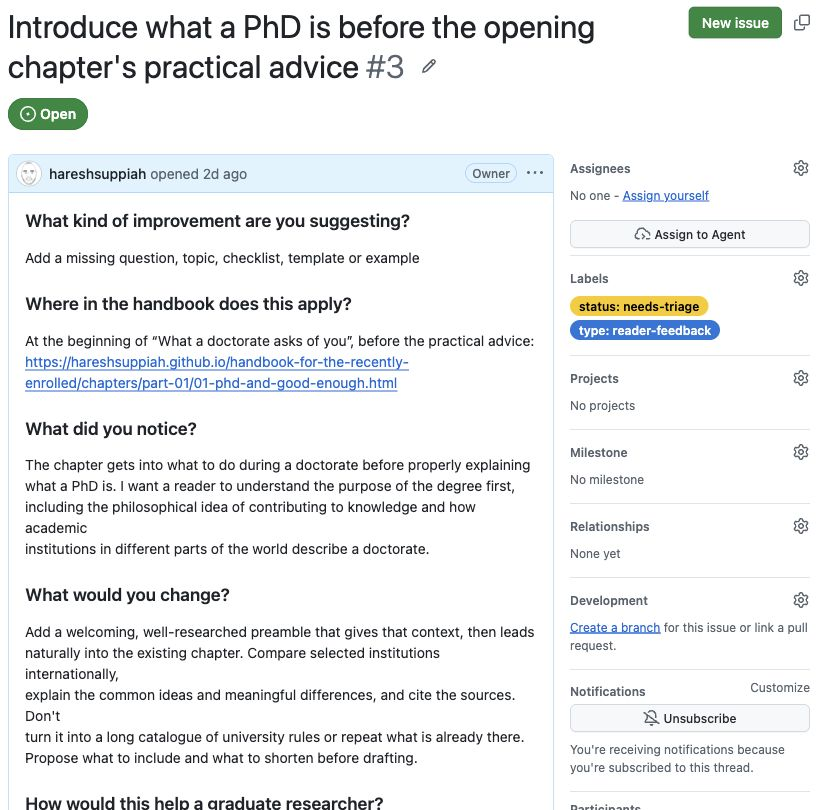

The public tracker is the handbook's GitHub Issues list. You can read it without creating an account. Sign in to submit a suggestion or reply.

[Open the live tracker](https://github.com/hareshsuppiah/handbook-for-the-recently-enrolled/issues){.btn .btn-primary}

Search for a few words from your question first. Open a matching issue to read the editor's response. If it covers your point, add useful detail there rather than submit the same suggestion again.

{fig-alt="GitHub issue 3 is Open with needs-triage and reader-feedback labels. Its main column contains the reader's answers. The side column shows no assignee and notification controls. This is a dated example, not a live progress display." width=820}

*Captured 8 September 2026 from a real suggestion. The owner sees additional editing controls. If you already follow an issue, GitHub shows **Unsubscribe**; otherwise use **Subscribe** to follow it. The labels and outcome may have changed since this capture.*

## Find the work you want to follow

- [All open suggestions](https://github.com/hareshsuppiah/handbook-for-the-recently-enrolled/issues?q=is%3Aissue%20is%3Aopen)
- [Approved suggestions](https://github.com/hareshsuppiah/handbook-for-the-recently-enrolled/issues?q=is%3Aissue%20label%3A%22decision%3A%20approved%22)
- [Drafting in progress](https://github.com/hareshsuppiah/handbook-for-the-recently-enrolled/issues?q=is%3Aissue%20label%3A%22work%3A%20in-progress%22)
- [Ready for editorial review](https://github.com/hareshsuppiah/handbook-for-the-recently-enrolled/issues?q=is%3Aissue%20label%3A%22work%3A%20owner-review%22)
- [Closed suggestions and their outcomes](https://github.com/hareshsuppiah/handbook-for-the-recently-enrolled/issues?q=is%3Aissue%20is%3Aclosed)

A filter can be empty. That means no matching records are visible; it does not demonstrate that automation is working.

## Read the status accurately

| Status | Meaning | What to look for next |
|---|---|---|
| Needs triage / needs evidence | The editor is checking the request or needs information | A question or assessment in the comments |
| Awaiting owner decision | Ready for an authorised editor to decide | An approval, deferral, decline or duplicate decision |
| Approved / agent-ready | Drafting is authorised; assignment may still be pending | A named assignee and linked pull request |
| In progress | Someone is preparing edits | The proposed change and checks |
| Owner review | The proposed edits are ready for editorial review | Review, revision or publication decision |
| Released | The accepted change has been published | The merged pull request and live page link |
| Closed | The issue is no longer open | Read the reason: closed can also mean declined or duplicate |

Labels summarise the record. Read the comments and linked pull request to confirm what actually happened. Some later status labels require an editor to update them; there is no promise that every transition updates automatically.

An issue is the request. A pull request is the proposed edit. A published page is the outcome. Approval of the request is separate from approval of its wording.

To start a new request, use [Suggest an improvement](index.qmd) or the [illustrated first-time guide](how-to-help.qmd).
