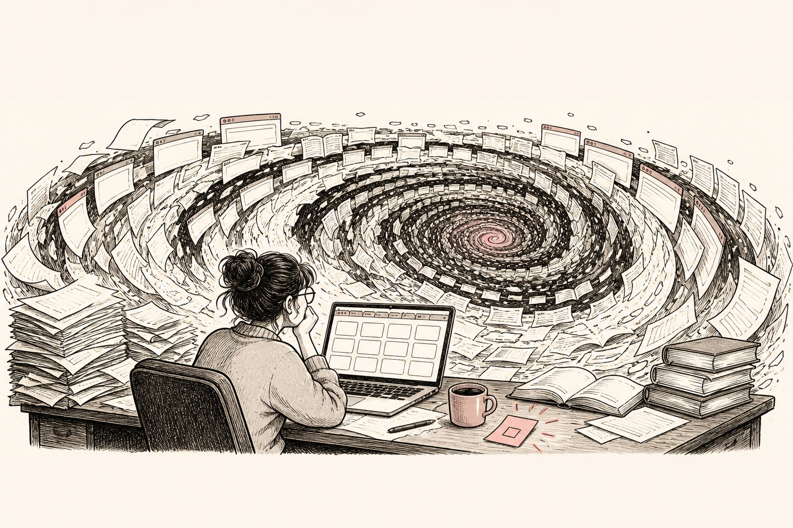

## Diagnose

Name whether the problem is orientation, terminology, retrieval, inclusion, extraction, comparison or argument. “More literature” is not yet a search purpose.

## Do now

1. State the decision or claim the search must support.
2. Choose the correct search-ladder level.
3. Define concepts, sources, dates and stopping evidence.
4. Triage before full extraction.
5. Compare studies in an evidence matrix.
6. Draft a bounded claim, contrary evidence, warrant and boundary.

::: {.handbook-visual .original-meme}
::: {.meme-line}
**I’ll stop after one more paper.**
:::

{fig-alt="A graduate researcher faces a whirlpool made from browser tabs, papers and references while a small decision remains untouched on the desk."}

::: {.meme-line}
**The paper has 63 references.**
:::

::: {.visual-credit}
Original illustration created for *The Handbook for the Recently Enrolled* with human editorial direction and AI-assisted production.
:::
:::

## Before asking

Bring the question, search level, exact strings/databases, results by step, inclusion rule, stopping rule and the claim you still cannot support.

## Stop or change route

Stop repeating near-identical searches when new runs add no decision-relevant concept or source. Seek librarian help when translation, indexing or coverage is the issue.

## Evidence of unstuck

The search has a purpose and reproducible record; the next action is extraction, synthesis or a specific targeted search—not “keep looking”.

Use the [search ladder](../checklists/search-ladder.qmd) and [synthesis map](../templates/synthesis-argument-map.qmd).

[Return to I’m stuck](index.qmd)
